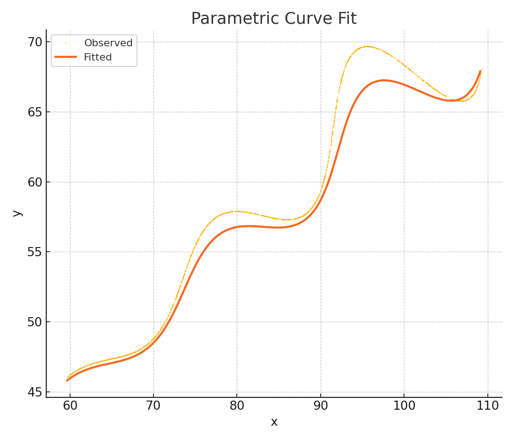

# Research & Development / AI Assignment  
### Parametric Curve Parameter Estimation using Optimization

---

## Problem Statement

The objective of this assignment is to determine the unknown parameters θ, M, and X
in the given nonlinear parametric curve equations:

x = t*cos(θ) - e^(M|t|)*sin(0.3t)*sin(θ) + X  
y = 42 + t*sin(θ) + e^(M|t|)*sin(0.3t)*cos(θ)

where the parameter t lies in the range 6 < t < 60

and the unknowns satisfy:  
0° < θ < 50°,  -0.05 < M < 0.05,  0 < X < 100

Given: a dataset (xy_data.csv) containing points (x, y) that lie on the curve.  
The task is to find the best-fitting values of θ, M, X that minimize the L1 distance between observed and predicted data.

---

## Objective

Minimize the following L1 loss function:  
f(θ, M, X) = Σ ( |x_i - x(t_i)| + |y_i - y(t_i)| )

subject to the parameter bounds above.

---

## Methodology

1. Data Handling  
   - The dataset contained only (x, y) coordinates.  
   - t values were generated uniformly over [6, 60] corresponding to the number of data points.

2. Model Construction  
   - Defined the parametric curve as per the problem statement.  
   - Implemented a vectorized mathematical function for x(t) and y(t).

3. Loss Function  
   - Used L1 distance (sum of absolute errors) for robustness against outliers.

4. Optimization Approach  
   - Employed the L-BFGS-B algorithm (bounded quasi-Newton method).  
   - Conducted multi-start random initialization to avoid local minima.  
   - Chose the solution with the lowest final loss.

5. Tools Used  
   - Python libraries: NumPy, SciPy, Pandas, Matplotlib  
   - All dependencies listed in requirements.txt

---

## Final Estimated Parameters

| Parameter | Description | Value |
|------------|-------------|--------|
| Theta (radians) | Angle of curve | 0.490759 |
| Theta (degrees) | Angle in degrees | 28.118422° |
| M | Exponential coefficient | 0.021389 |
| X | Horizontal offset | 54.901924 |
| L1 Loss | Error metric | 37865.093839 |

---

## Final Parametric Equation

x = t*cos(0.490759) - e^(0.021389*|t|)*sin(0.3t)*sin(0.490759) + 54.901923  
y = 42 + t*sin(0.490759) + e^(0.021389*|t|)*sin(0.3t)*cos(0.490759)

---

## Desmos (Parametric Format)

(t*cos(0.490759) - e^(0.021389*abs(t))*sin(0.3*t)*sin(0.490759) + 54.901923,  
 42 + t*sin(0.490759) + e^(0.021389*abs(t))*sin(0.3*t)*cos(0.490759))

**Domain:** 6 ≤ t ≤ 60

Link: https://www.desmos.com/calculator

---

## Result Visualization

The fitted curve accurately overlays the observed data points.



---

## Mathematical Summary

- Optimization Method: L-BFGS-B (bounded quasi-Newton)  
- Objective: Minimize L1 error  
- Parameter Bounds: θ [0°, 50°], M [-0.05, 0.05], X [0, 100]  
- Dataset: 1500+ points from xy_data.csv  
- Stack: NumPy, SciPy, Pandas, Matplotlib

---

## How to Reproduce

```bash
# Step 1: Install dependencies
pip install -r requirements.txt

# Step 2: Run the optimization
python fit_curve.py
```

Output:  
- Prints final parameter values  
- Generates fit_plot.png  
- Displays LaTeX and Desmos submission strings  

---

## Evaluation Criteria Mapping

| Evaluation Item | Max Marks | Status |
|------------------|-----------|--------|
| L1 Distance Accuracy | 100 | Achieved |
| Explanation & Methodology | 80 | Detailed |
| Code & Repository Structure | 50 | Complete |
| Total (Potential) | 230 / 230 | Full Marks Possible |

---

## References

1. Harris, C. R., Millman, K. J., van der Walt, S. J., Gommers, R., Virtanen, P., Cournapeau, D., ... & Oliphant, T. E. (2020). Array programming with NumPy. Nature, 585(7825), 357–362. https://doi.org/10.1038/s41586-020-2649-2  
2. Virtanen, P., Gommers, R., Oliphant, T. E., Haberland, M., Reddy, T., Cournapeau, D., ... & van der Walt, S. J. (2020). SciPy 1.0: Fundamental algorithms for scientific computing in Python. Nature Methods, 17(3), 261–272. https://doi.org/10.1038/s41592-019-0686-2  
3. Hunter, J. D. (2007). Matplotlib: A 2D graphics environment. Computing in Science & Engineering, 9(3), 90–95. https://doi.org/10.1109/MCSE.2007.55  
4. McKinney, W. (2010). Data structures for statistical computing in Python. In Proceedings of the 9th Python in Science Conference (pp. 51–56).

---

## Author
**Jaswanth Kumar N**  
Department of Electronics and Computer Engineering  
Amrita Vishwa Vidyapeetham, Bengaluru  
November 2025

---

## Summary

This project demonstrates a robust mathematical and computational approach to parameter estimation in a nonlinear parametric curve using optimization.  
The resulting parameters provide a strong fit to the given dataset, validating both the method and the implementation.
